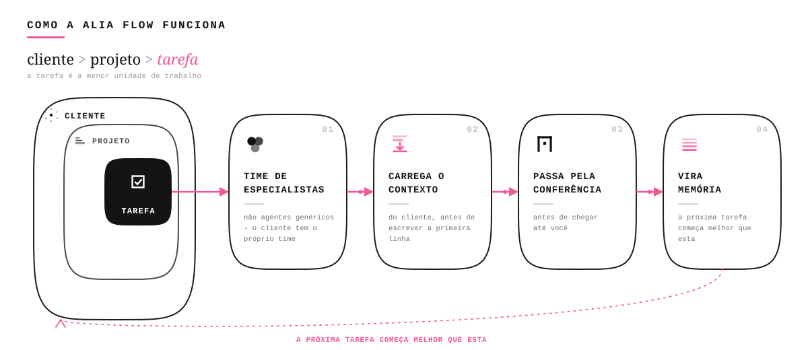

# Alia Flow

Você diz o que precisa em palavras comuns. A Alia cuida do trabalho do começo ao fim e só te
entrega o que já passou por uma conferência.

---

`MIT` - `versão atual em` [`VERSION`](VERSION) - `Windows (PowerShell 5.1+); Mac/Linux ainda não validados`

---

## Pra quem é

Você não é técnico. E não precisa ser.

- Você toca um negócio, uma marca ou um projeto e quer usar IA de verdade, sem virar programador.
- Você pede o resultado em português comum - um email, uma copy, uma análise, uma tela - e recebe
  pronto, não um rascunho pra você arrumar.
- Você não reexplica o seu negócio toda vez: a Alia lembra do seu contexto de uma vez para a
  próxima.
- O que chega até você já foi conferido antes - ninguém te entrega algo cru e some.

---

## Como funciona



Você cadastra um Cliente (o seu negócio, ou o de quem você atende). Dentro dele, um Projeto.
Dentro do Projeto, uma Tarefa - o pedido de hoje. A Alia monta, para aquele Cliente, um time de
especialistas próprio; antes de começar, cada especialista carrega o que já se sabe daquele
Cliente, para não tratar seu negócio como genérico. O resultado passa por uma conferência antes de
chegar em você. E o que se aprendeu no caminho vira memória - a próxima tarefa do mesmo Cliente já
começa sabendo mais.

---

## O time que ela monta pra você

Cada Cliente que você cadastra ganha o próprio time de especialistas - não um assistente
genérico que responde qualquer coisa para qualquer pessoa. Cada especialista carrega o
conhecimento daquele negócio: o tom de voz, o público, as decisões já tomadas, o que já funcionou
antes. É a Alia quem escolhe a mão certa para cada pedido e responde pelo resultado final.

---

## Começar

Pré-requisito: um coding agent instalado (por exemplo, o Claude Code). A Alia mora dentro dele,
não roda sozinha.

> Repositório em beta fechado hoje - a linha de instalação abaixo passa a responder quando a
> visibilidade abrir, sem data prometida. Sistema operacional: só Windows (PowerShell 5.1+) foi
> provado até aqui.

```sh
iwr -useb https://raw.githubusercontent.com/gufarina/alia.flow/main/scripts/install.ps1 | iex
```

Abra a pasta instalada no seu coding agent. Na maioria das vezes a Alia já assume sozinha. Se não
acontecer, ou se quiser chamá-la a qualquer momento durante a conversa, digite:

### `/alia`

(também funciona como `alia`, `$alia` ou `--alia`, dependendo do programa que você usa)

Detalhe do que funciona em cada coding agent: [docs/COMPATIBILIDADE.md](docs/COMPATIBILIDADE.md).
Lista completa de comandos de manutenção (atualizar, checar integridade, versionar o seu studio):
[docs/](docs/).

---

## Antes / depois

O mesmo pedido, dois caminhos.

**"Escreva a copy da landing do meu produto."**

| | Chat genérico | Alia Flow |
|---|---|---|
| Registro | A conversa some quando você fecha a aba. | Fica guardado, amarrado ao Cliente e ao Projeto certos. |
| Contexto | Só o que você colar na hora. | Carrega o que já se sabe do seu negócio antes de escrever. |
| Resultado | O primeiro texto que sair, do jeito que sair. | Passa por uma conferência antes de chegar em você. |
| Memória | Nenhuma. Amanhã começa do zero. | O que foi feito hoje ajuda a próxima tarefa do mesmo Cliente. |

Não é promessa solta: dá para conferir em disco, com um exemplo real ponta a ponta, em
[`studio.example/clients/acme-saas/`](studio.example/clients/acme-saas/).

---

## As provas

O motor confere a si mesmo: um trilho de verificações automáticas que não gastam nenhum token de
modelo (279 na versão atual; o número exato aparece no fim do teste). Na última rodada: **279
PASS, 0 FAIL**. Qualquer pessoa com acesso ao código roda de novo e confere. Repositório ainda em
beta fechado: o comando abaixo funciona hoje num clone local; a instalação pública passa a
responder quando a visibilidade abrir.

```sh
powershell -ExecutionPolicy Bypass -File scripts/smoke-test.ps1
```

Sobre a memória, uma ressalva honesta: existe uma demonstração de como o contexto muda o
resultado, mas ela é ILUSTRATIVA. As duas respostas comparadas foram escritas à mão para mostrar
o padrão esperado, não geradas por um agente respondendo duas vezes. O teste prova que a
contagem funciona, não que a memória melhora a saída de um agente real. O código está aberto em
[`studio.example/clients/acme-saas/tests/knowledge-ablation/score.py`](studio.example/clients/acme-saas/tests/knowledge-ablation/score.py).

---

## Perguntas frequentes

**Preciso saber programar para usar?**
Não. Você pede em português comum, dentro do seu coding agent. Você só precisa ter um coding
agent instalado primeiro - o Alia Flow mora dentro dele, não roda sozinho.

**O repositório está aberto para clonar agora?**
Não. Está em beta fechado hoje; a linha de instalação deste README passa a funcionar quando a
visibilidade abrir, sem data prometida.

**Funciona no Mac ou Linux?**
Ainda não foi validado. Hoje o produto roda comprovadamente só em Windows (PowerShell 5.1+).
Suporte a Mac/Linux está no roteiro, sem data.

**Se a Alia errar, alguém barra antes de chegar em mim?**
Todo resultado passa por uma etapa de conferência antes de sair. Hoje essa etapa é cobrada e
registrada, mas ainda depende da Alia seguir o processo - não existe, ainda, uma trava física que
impeça um resultado de escapar dela.

---

## Licença e créditos

[MIT](LICENSE) (c) The Alia Flow Authors.

O Alia Flow se apoia em frameworks, métodos e mestres que vieram antes - **aiox**,
**BMAD-METHOD**, Domain-Driven Design, **ponytail** (Dietrich Gebert, MIT) e outros. Os Expert
Minds carregam a metodologia pública de mestres reais de cada campo (Ogilvy, Kent Beck, Brad
Frost, Eugene Schwartz, Sean Ellis) - crédito a eles pelo método, a implementação é nossa.
Créditos e fontes completos em [CREDITS.md](CREDITS.md). Como contribuir:
[CONTRIBUTING.md](CONTRIBUTING.md).

---

<p align="center">
  
</p>

<p align="center"><em>Você não é técnico. E não precisa ser. O gargalo deixa de ser você.</em></p>
