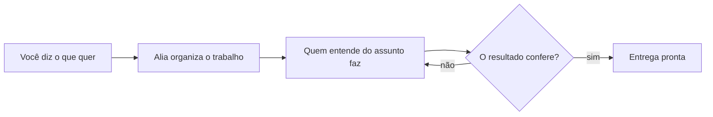
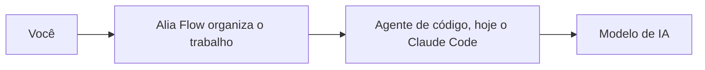

<p align="center"></p>

# Alia Flow

**Você diz o que quer. A Alia faz acontecer.**

`MIT` · [`VERSION`](VERSION) · Windows (PowerShell 5.1+) · roda dentro do Claude Code

---

# Para quem não é técnico

## O que é a Alia

Você escreve o que quer, na sua língua do dia a dia. A Alia Flow é um fluxo agêntico: em vez de uma
pergunta e uma resposta isolada, o pedido passa por etapas encadeadas, conduzidas por um agente, até
o trabalho ficar pronto e conferido. Ela não é um chat que esquece tudo a cada conversa. Ela lembra
do seu projeto e nunca solta nada sem checar antes.

Ela é o braço direito que você sempre quis.

Você não é técnico. E não precisa ser.

## O problema

Você quer usar IA para trabalhar. Você não programa e não quer aprender. Aí toda ferramenta faz uma
de duas coisas. Ou pede um termo técnico que você não conhece. Ou responde rápido demais, sem
perguntar nada, e entrega algo que você não sabe se está certo.

Duas dores aparecem em toda conversa.

**Você repete o contexto toda vez.** Abre uma conversa nova e explica de novo o que já tentou, o que
decidiu e o que descartou.

**Você não sabe se o que saiu está certo.** Veio rápido. Ninguém checou. Você usa mesmo assim ou
joga fora.

O resto vem junto. Você tem medo de perguntar errado, então pergunta pouco e recebe resposta rasa.
Você faz tudo sozinho, passo a passo, e quem junta as peças no fim é você. E amanhã você começa do
zero, porque a ferramenta não aprendeu nada do seu jeito de trabalhar.

O concorrente aqui não é outro aplicativo. É o hábito de abrir um chat, receber uma resposta pronta
e decidir sozinho se ela serve.

**Hoje você pergunta e recebe uma resposta. Com a Alia, você pede um resultado e recebe um trabalho
pronto.**

## Como a Alia resolve

São três coisas, e elas andam juntas.

**1. Ela guarda o seu contexto.** O que você explicou fica registrado em arquivos na sua máquina. Na
segunda vez você não conta tudo de novo. Se você cuida de mais de um cliente ou projeto, cada um
tem o seu próprio contexto, separado do resto.

**2. Ela pergunta antes de agir.** Se falta informação para fazer direito, ela pergunta. Nada
importante é decidido no chute, e nada acontece sem você saber.

**3. Ela confere antes de entregar.** O trabalho passa por uma checagem antes de chegar até você.
Se não passa, volta para ser refeito. Você recebe o resultado conferido, não o primeiro rascunho.

## Como funciona, do pedido à entrega



Leia da esquerda para a direita. Você pede. A Alia organiza e escolhe quem faz. O trabalho é
checado. Se não passa na checagem, volta para ser refeito. Só sai quando passa.

## Como começar

Você precisa de uma coisa antes: o **Claude Code**, um programa da Anthropic. Ele é pago e é de
outra empresa. A Alia roda dentro dele. Sem o Claude Code, nada aqui funciona.

1. Instale o Claude Code em https://claude.com/claude-code e entre com a sua conta.
2. Abra o PowerShell no Windows e cole a linha abaixo.
3. Abra a pasta instalada no Claude Code. Nesse momento ele vira a Alia e se apresenta. Se a tela
   ficar genérica, sem ela falar, digite `/alia` e aperte Enter. Isso liga ela na hora.

A partir daí é conversa. Não existe comando para decorar.

```powershell
irm https://raw.githubusercontent.com/gufarina/alia.flow/main/scripts/install.ps1 | iex
```

A linha acima responde publicamente hoje. Ainda não existe um arquivo pronto para baixar na página
de releases, e a versão publicada está uma atrás da atual.

O melhor primeiro pedido é um trabalho de verdade. Diga quem você é, para quem você vende e o que
precisa ficar pronto. Exemplo: "Tenho uma barbearia em Curitiba, público jovem. Quero um post de
Instagram anunciando que agora abrimos sábado até as 20h, no meu tom, descontraído."

## O que muda na prática

**Você pede um post e recebe um post revisado.** Você não explica o seu negócio de novo. A Alia já
sabe quem é o seu público e qual é o seu tom, porque isso ficou guardado da última vez.

**Você toca três clientes ao mesmo tempo sem misturar nada.** Cada cliente tem contexto próprio. O
tom de um não vaza para o outro.

**Você pede uma coisa grande e ela vira etapas.** Um calendário de posts da semana não volta como um
bloco de texto cru. Ele passa por quem entende de conteúdo e por uma checagem antes de chegar.

**Você erra menos por falta de pergunta.** Quando o pedido está vago, ela pergunta em vez de chutar.

## Perguntas frequentes

**Preciso saber programar?**
Não. Você escreve em português comum. Um passo da instalação passa por uma janela de comando, e ele
está explicado acima, linha por linha.

**Meus dados vão para algum servidor?**
Não vão para nenhum servidor nosso. Tudo roda na sua máquina, dentro do programa que você já usa.
Não existe servidor do Alia Flow nem banco de dados hospedado por ele. A memória são arquivos
comuns, no seu disco, que você pode abrir, ler, mover ou apagar. O que você conversa passa pelo
Claude, da Anthropic, como em qualquer uso do Claude.

**É pago?**
O Alia Flow é gratuito e de código aberto, com licença MIT. O Claude Code, que roda por baixo, é
pago e é de outra empresa.

**Como eu atualizo?**
Dois cliques em `atualizar-alia.bat`. Ele baixa a versão nova, guarda uma cópia datada do que
existia antes e troca só o motor. Seus clientes e sua memória não são tocados.

**E se a atualização der problema?**
Dois cliques em `reverter-alia.bat`. Ele mostra as cópias de segurança que existem, com data, avisa
o que vai restaurar e só age depois que você confirmar. Seus dados nunca entram nessa troca.

**A Alia faz as coisas sozinha?**
Não, e isso é de propósito. Ela pergunta antes de agir e depende da sua decisão. Ela organiza e
confere o trabalho. Quem decide é você.

**Ela funciona em Mac ou Linux?**
Hoje não. Veja os limites abaixo.

## Limites honestos

- **Windows.** O produto foi provado no Windows, com PowerShell 5.1 ou superior. Mac e Linux não
  estão validados.
- **Dentro do Claude Code.** O fluxo completo só foi validado no Claude Code. Outros agentes de
  terminal estão no plano, não são promessa de hoje.
- **Beta.** É uma versão em teste. Coisas mudam, e a sua opinião sobre o que travou vale ouro.

---

# Para quem é técnico

## O que é, tecnicamente

Alia Flow não é modelo nem aplicativo. É uma camada de orquestração agêntica: arquivos de instrução
em markdown, scripts determinísticos em PowerShell e hooks que rodam por cima de um agente de código
já existente, hoje o Claude Code. Não hospeda modelo e não é wrapper de API. O que ele entrega é
engenharia de contexto estruturada, com scripts sem chamada de modelo cuidando da parte que não
precisa de inteligência, como registrar estado, checar um arquivo ou bloquear uma escrita.

## Onde a Alia fica na pilha

O Alia Flow é um harness de orquestração. Ele não substitui o agente de código. Ele roda por cima
dele. Quem roda o loop e chama o modelo é o agente hospedeiro, hoje o Claude Code. Quem define
papéis, protocolo, memória e portões de qualidade é o Alia Flow. Nota de vocabulário: dentro do
motor a palavra "harness" também nomeia o host, e é isso que o `detect-harness.ps1` identifica. A
pilha abaixo mostra cada camada no seu lugar.



## O protocolo

Todo pedido passa pelos mesmos cinco passos, do ajuste menor ao projeto maior.

1. **IDENTIFICA** o cliente e o projeto. Sem cliente, não existe tarefa.
2. **REGISTRA** a tarefa em disco antes de delegar.
3. **DELEGA** ao especialista daquele domínio.
4. **MONITORA** e cobra o artefato, a prova concreta.
5. **FECHA** com o gate de qualidade, grava o aprendizado e registra o custo.

Sem artefato, a tarefa não fechou, mesmo que a resposta em texto pareça completa.

## Como a delegação funciona

O coordenador não executa o domínio com a própria mão. Ele roteia para um especialista, um
sub-agente gerado a partir de três arquivos por cliente: uma persona, uma config com domínio,
ferramentas e modelo, e uma pasta de conhecimento daquele domínio. Um script transforma isso no
arquivo que o host reconhece como sub-agente invocável. Cada especialista nasce escrito para o
negócio de quem pediu. Não existe catálogo fixo.

São dois modos. No **modo spawn**, com sub-agente nativo, o próprio host lê o frontmatter e aplica
ferramentas e modelo na sessão do sub-agente. A garantia vem do host. No **modo context-load**, sem
sub-agente nativo, o coordenador carrega um briefing em texto e assume o papel no próprio turno.
Aqui não existe frontmatter lido por máquina. A lista de ferramentas vira prosa.

## Mecanismo real versus contrato lido

Nem tudo que soa como regra é físico, e vale separar.

**Bloqueio de saída: mecanismo real.** Um hook roda ao fim de cada turno e confere por regex
determinístico, sem modelo e sem rede, se um turno que editou arquivo de domínio chamou um
sub-agente antes da escrita, e se uma resposta com três ou mais afirmações de peso carrega rótulo de
proveniência. Falhou, bloqueia de verdade.

**Lista de ferramentas por especialista: contrato lido.** No modo spawn o host aplica o frontmatter.
Dentro do motor, nenhum hook confere se a ferramenta chamada bate com a lista declarada.

**Aprendizado com o próprio uso: não é autônomo.** O único gatilho mecânico é o de estouro de
orçamento, um script que compara custo declarado contra custo real. Perceber padrão, propor correção
e testar dependem de um agente ler o relatório e agir. O que é mecânico de verdade é o portão que
barra qualquer mudança na constituição do motor sem aprovação humana explícita.

**Rotina agendada: nenhuma.** O motor removeu o uso do agendador do sistema operacional de
propósito. A única rotina periódica que sobrou, a curadoria de memória, roda dentro do script de
prova.

## Memória

Não há banco de dados nem embedding. A memória é um conjunto de arquivos markdown em disco, um por
aprendizado, cada um com validade (vigente, vencida, superada), mais um índice que resume cada nota
em uma linha e um índice estrutural gerado por script, sem custo de modelo. Nota antiga se arquiva,
nunca se apaga. É isso que deixa a próxima sessão recuperar contexto lendo o índice em vez de
reprocessar tudo.

## Onde roda e o que não está provado

Tudo roda localmente, dentro do processo do agente que você já usa. Sem servidor remoto, sem banco
hospedado. O fluxo completo está validado de ponta a ponta em Windows, PowerShell 5.1 ou superior,
dentro do Claude Code. Codex e OpenCode têm o disco pronto, mas a última prova ao vivo é anterior e
não foi repetida. Isso não é promessa de compatibilidade.

## Verificações

433 verificações determinísticas passam hoje, sem chamar IA
(`scripts/smoke-test.ps1`).

## Licença

MIT.
