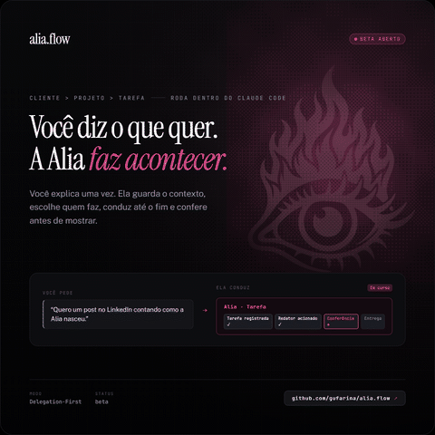

# Alia Flow

**Você diz o que quer. A Alia faz acontecer.**

---

`MIT` · `versão atual em` [`VERSION`](VERSION) · `Windows (PowerShell 5.1+); Mac/Linux ainda não validados`

---

Você diz, em palavras comuns, o que precisa ficar pronto. A Alia registra como tarefa, aciona o
especialista certo, conduz o trabalho até o fim, confere antes de mostrar e guarda o contexto
para a próxima vez. Roda dentro do seu Claude Code.

## Como funciona

- **Cliente** agrupa o contexto de quem você atende (ou de você mesmo).
- **Projeto** organiza o trabalho dentro de um Cliente.
- **Tarefa** é a menor unidade: nasce com um pedido, termina com uma entrega conferida.

## Instalação

```powershell
irm https://raw.githubusercontent.com/gufarina/alia.flow/main/scripts/install.ps1 | iex
```

## Números

338 verificações determinísticas passam hoje, sem chamar IA (`scripts/smoke-test.ps1`).

## Licença

MIT.
